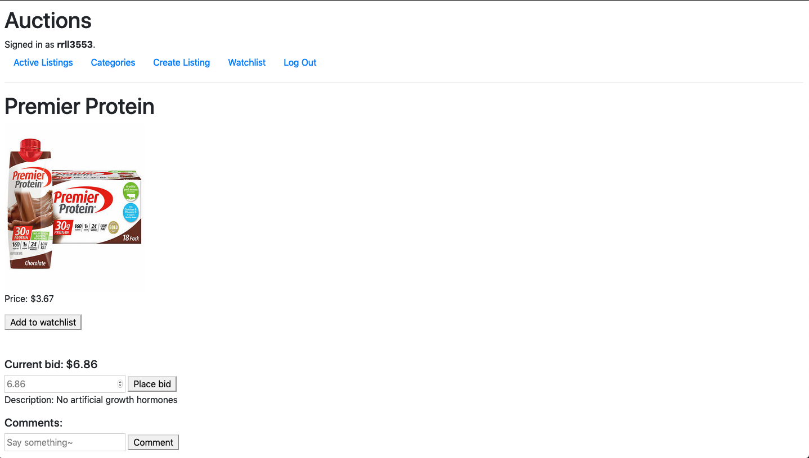

# Commerce site

This project is an Ebay-like site with the ability to post new listings, bid, and comment on items.

Technology used:

- Python 3.6
- Django 3.0

## Features

- Ability to have users
- Ability to add comments
- Ability to create new listings and bid on items

## Screenshots

## Deployment

Via the terminal navigate to the folder that includes manage.py.

Run:

`python manage.py runserver`

Follow the link to:

http://127.0.0.1:8000/

## Improvements

- Functional watchlist and category list
- User can close the bid

## Credits

[CS50 Web Programming with Python and Javascript Project](https://cs50.harvard.edu/web/2020/projects/2/commerce/)
